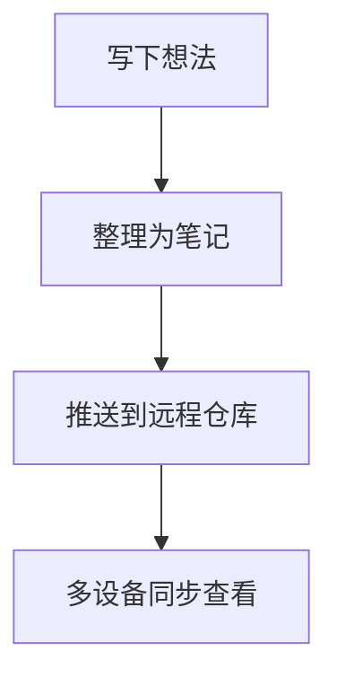

# 知夏笔记官网内容规则

本规则用于约束 `https://www.zhixianote.cn` 官网的文案和信息结构，所有页面都应遵循：

- 只描述**当前已实现**的功能，不写虚构能力；
- 不展示 GitHub 等代码仓库地址链接；
- 文案统一使用简体中文，风格简洁、直接。

## 1. 核心定位：知夏笔记是做什么的

- **一句话定位**：本地优先的 Markdown 笔记与个人信息管理工具。
- **核心卖点**：
  - 所有笔记和数据都保存在用户自己的设备和仓库中，本地优先；
  - 内置 Git 同步能力，可将笔记同步到用户自有的远程 Git 仓库；
  - 支持对敏感笔记内容进行本地加密，由主密码保护，官方无法解密；
  - 在一个应用里同时管理笔记、日记、待办、日程、密码等。
- 官网必须在首屏清晰回答三个问题：
  1. 这是什么工具；
  2. 适合谁用（写作、知识管理、程序员、开发者等）；
  3. 和普通云笔记相比的差异点（本地优先、Git 同步、隐私安全）。

建议首屏结构：

- 左侧：一句话 Slogan + 2～3 条核心卖点；
- 右侧：应用截图（编辑器 + 侧边栏 + 功能百宝箱）。

## 2. 数据存储与安全说明

这一部分必须独立成区块，例如「数据存储与安全」或「隐私与安全」。

需要明确说明：

- **本地优先存储**：
  - 用户第一次使用时会选择一个本地目录作为「笔记仓库」；
  - 所有 Markdown 文件、附件、日记等都存放在这个目录下；
  - 应用不会把内容上传到任何第三方服务器。
- **Git 同步机制**：
  - 应用支持把本地笔记仓库同步到用户自己的远程 Git 仓库；
  - 同步基于 Git 协议，由用户配置远程地址和访问凭证；
  - 同步的目标仓库由用户完全掌控，官方不托管数据。
- **密码与笔记数据加密**：
  - 密码管理器使用对称加密（AES-256-GCM）存储账号密码等敏感信息；
  - 支持对单篇笔记内容进行本地 AES 加密，解密操作需要主密码；
  - 加密密钥来源于用户设置的主密码，主密码不会明文保存在磁盘上，官方无法代为恢复；
  - 未解锁时，密码数据不可见，加密笔记内容在应用内也不可直接编辑。
- **离线可用**：
  - 在未配置任何远程仓库时，应用完全可以离线使用；
  - 授权码验证在本地进行，不依赖网络。

禁止出现：

- 任何形式的源代码仓库地址链接（例如 GitHub 仓库链接）；
- 暗示数据会上传到官方服务器的表述。

## 3. 功能总览

官网需要有一个「功能概览」区域，按照模块分组介绍目前已实现的能力。建议分为：

- **写作与知识管理**：
  - Markdown 编辑器（见第 7 节详细说明）；
  - 文件树与标签系统；
  - 全文搜索和快速跳转。
- **时间与任务管理**：
  - 日程（Schedule）：创建带开始/结束时间的事件，支持状态标记；
  - 待办清单（Todo）：按清单管理任务，支持完成状态、已完成折叠等；
  - 日记（Diary）：日历视图 + 每日 Markdown 日记文件。
- **效率与工具**：
  - Git 同步与自动备份；
  - 功能百宝箱（喝水提醒、密码管理等入口）；
  - 回收站与撤销删除。
- **隐私与安全**：
  - 本地优先存储；
  - 密码管理器加密；
  - 单篇笔记内容本地加密（主密码保护）；
  - 授权码离线校验。

每个功能模块的介绍要求：

- 保持 1～2 句简短描述，重点讲「能为用户解决什么问题」；
- 搭配一张实际界面截图（后续可按模块补充）。

## 4. 免费版与授权版的功能边界

官网需要有单独的「版本与授权」区域，内容要与 `docs/license_features.md` 保持一致，只突出用户能感知到的差异。

### 4.1 免费版（Free）

无需授权码即可使用，包含：

- 基础 Markdown 编辑与预览；
- 文件管理：新建、重命名、移动、删除、回收站；
- 基础主题（默认主题 + 深浅色模式切换）；
- Git 同步的基础能力（用户自行配置远程仓库）；
- 日程与待办的基础使用；
- 本地日记（如当前实现已开放）。

### 4.2 高级版（Premium）

通过授权码解锁后额外提供：

- 特色主题（例如拟物风格、高对比度主题等）；
- 高级功能百宝箱中的部分功能：
  - 喝水提醒；
  - 部分高级日记特性（如加密日记库）；
- 其它在应用内标记为「需要授权」的功能入口。

官网上表述规则：

- 使用简明对比表：「功能 / 免费版 / 高级版」三列；
- 与应用内开关保持一致：凡是点击会弹出授权窗口的功能，都归入「高级版」；
- 不在官网展示尚未实现的高级功能。

## 5. 其他建议展示模块

除了上面的核心信息，建议官网增加以下模块：

- **使用场景**：
  - 「写作与博客草稿」、「知识库与学习笔记」、「工作日志与周报」、「个人生活记录」等场景；
  - 每个场景用 2～3 行文字+一张界面截图说明。
- **简单上手步骤**：
  - 第一步：下载并安装应用；
  - 第二步：选择或创建本地笔记仓库；
  - 第三步：创建第一篇笔记 / 设置 Git 同步；
  - 第四步：根据需要开启日程、待办、日记等模块。
- **常见问题（FAQ）**：
  - 授权码购买与找回；
  - 更换电脑后的授权使用；
  - 笔记目录迁移与备份；
  - 卸载应用前如何备份数据。

## 6. 页面与性能要求

- 当前部署：Git 托管静态站点，国内访问可能存在一定延迟；
- 官网前端应保持：
  - **纯静态或极少 JS**：尽量减少运行时 JS 体积；
  - 尽量少用第三方字体和脚本，避免跨域资源拖慢首屏加载；
  - 所有截图和图片进行压缩处理，控制单图体积；
  - 尽量复用浏览器缓存（文件名带 hash，版本升级时再变更）。
- 页面结构建议：
  - 保持单页结构（Single Page），通过锚点导航跳转到不同区块；
  - 顶部导航包含：产品介绍、功能、数据与安全、价格与授权、常见问题、下载；
  - 尽量避免复杂的动效和大面积视频背景。

## 7. Markdown 编辑功能与样式展示

这一节用于官网上专门介绍「Markdown 编辑器」，并展示不同语法在 Zhixia Note 中的渲染效果。文案要与 `docs/markdown_features.md` 一致。

### 7.1 功能要点

- 基于 GFM 标准，支持：
  - 标题、列表、引用、代码块、表格等基础语法；
  - 任务列表（待办复选框），可交互勾选；
  - 行内/块级代码高亮，多种编程语言；
  - 自动链接、图片、分割线等；
  - Wikilinks 双向链接（`[[页面名]]` / `[[页面名|别名]]`）；
  - Mermaid 图表（流程图、时序图、类图、思维导图等）；
  - 数学公式（若当前版本已支持）。
- 支持左右分屏：一侧编辑，一侧实时预览；
- 支持自定义主题，对 Markdown 渲染样式做整体配色。

### 7.2 Markdown 示例片段

下面是推荐放在官网上的示例 Markdown 内容，你可以在应用中创建一篇笔记，粘贴以下内容，应用对应主题，然后对渲染结果截图，分别放到「标题」「列表」「代码块」「Mermaid 图表」等介绍区域。

```markdown
# 知夏笔记 Markdown 示例

> 本地优先 · Git 同步 · 多场景笔记管理

## 1. 基础排版

这是普通正文内容，可以用来记录想法、会议纪要或学习笔记。

- 无序列表项一
- 无序列表项二
  - 支持嵌套列表

1. 有序列表第一步
2. 有序列表第二步

**加粗文本**、*斜体文本*、`行内代码` 都是常见写法。

---

## 2. 代码块与高亮

```ts
function helloZhixia(name: string) {
  console.log(`Hello, ${name} 👋`);
}

helloZhixia('Zhixia Note');
```

## 3. 任务列表

- [ ] 写一篇新的日记
- [x] 配置好 Git 同步
- [ ] 整理一周的工作笔记

## 4. 表格示例

| 模块     | 说明           | 状态 |
|----------|----------------|------|
| Markdown | 编辑与预览     | ✅   |
| 日程     | 事件与提醒     | ✅   |
| 待办     | 任务管理       | ✅   |
| 密码箱   | 账号密码管理   | ✅   |

## 5. Mermaid 图表示例


```

截图建议：

- 对「标题 + 引用 + 列表」区域截图；
- 对「代码块」区域单独截图，突出高亮风格；
- 对「任务列表」展示勾选效果；
- 对 Mermaid 图展示其配色与布局。

## 8. 文案与样式一致性

- 官网上展示的文案应尽量与应用内实际按钮/菜单名称一致；
- 任何提到的功能入口，都应能在应用里找到对应位置；
- 当应用有较大 UI 变动时，需要同步更新官网截图和相关描述。
